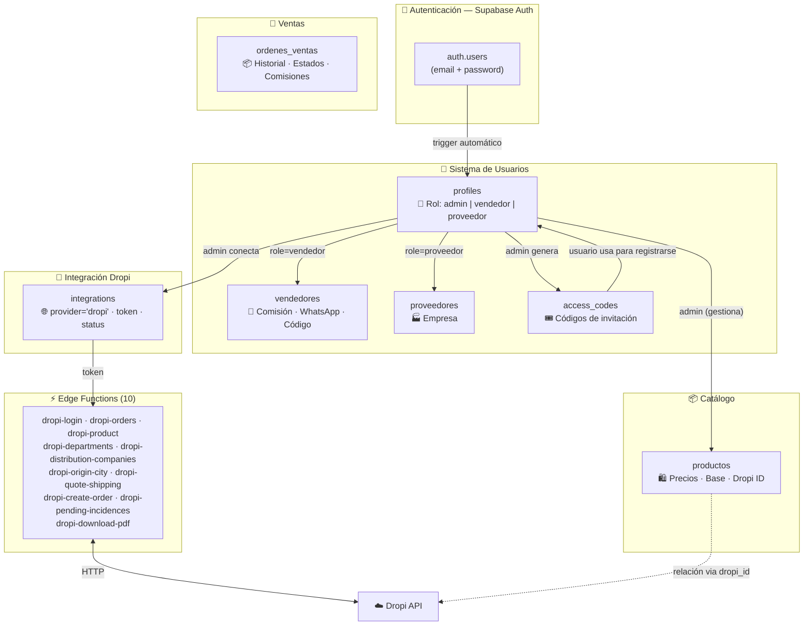
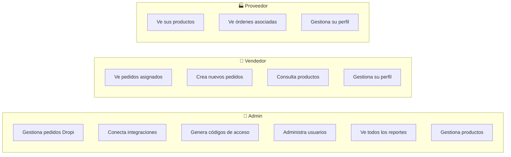
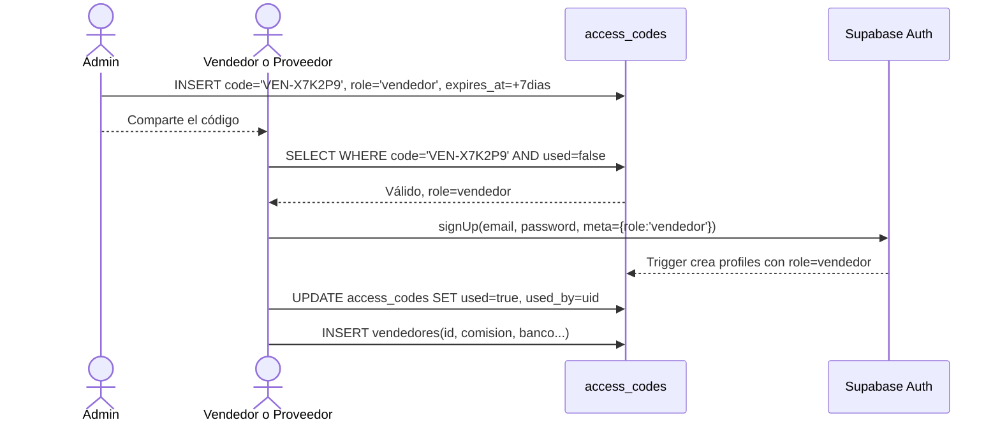
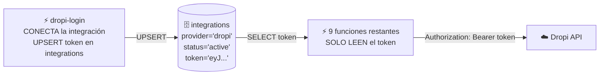
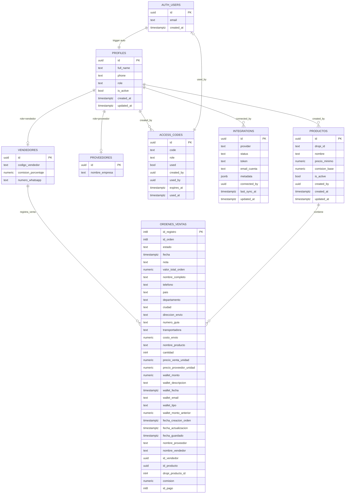

# 📚 Documentación — Base de Datos EC Express Plataforma

> **Proyecto Supabase:** `mphngdkxxibdaegehlmj` — EC EXPRESS PLATAFORMA  
> **Última actualización:** Abril 2026

---

## 🏗️ Visión General de la Arquitectura

La plataforma tiene **3 tipos de usuario** y se comunica con **Dropi** a través de Edge Functions. Todo el sistema está construido sobre Supabase.

---

## 👥 Roles del Sistema

---

## 📋 Tablas — Detalle Completo

### 1. `profiles` — Perfil Base

Toda cuenta creada en Supabase Auth genera automáticamente un perfil gracias a un **trigger**.

| Campo | Tipo | Descripción |
|-------|------|-------------|
| `id` | UUID PK | Mismo UUID que `auth.users` |
| `full_name` | TEXT | Nombre completo |
| `phone` | TEXT | Teléfono |
| `role` | TEXT | `admin` · `vendedor` · `proveedor` |
| `is_active` | BOOL | Permite desactivar sin eliminar |
| `avatar_url` | TEXT | Foto de perfil |
| `created_at` | TIMESTAMPTZ | Fecha de creación |
| `updated_at` | TIMESTAMPTZ | Última actualización |

---

### 2. `access_codes` — Códigos de Invitación

El admin genera códigos únicos para que vendedores y proveedores puedan registrarse.

| Campo | Tipo | Descripción |
|-------|------|-------------|
| `code` | TEXT UNIQUE | Ej: `VEN-X7K2P9` o `PROV-AB12CD` |
| `role` | TEXT | Solo `vendedor` o `proveedor` |
| `used` | BOOL | `true` cuando ya fue utilizado |
| `expires_at` | TIMESTAMPTZ | Vence a los 7 días por defecto |
| `created_by` | UUID → profiles | Admin que generó el código |
| `used_by` | UUID → auth.users | Quién lo usó |

---

### 3. `vendedores` + `proveedores` — Datos Específicos

Tablas complementarias que extienden el perfil según el rol.

| Campo vendedores | Descripción |
|------------------|-------------|
| `codigo_vendedor` | Código único del vendedor |
| `comision_porcentaje` | % de comisión |
| `numero_whatsapp` | Número de WhatsApp para contacto |

| Campo proveedores | Descripción |
|-------------------|-------------|
| `nombre_empresa` | Nombre de la empresa o proveedor |

---

### 4. `integrations` — Integración con Dropi

Centraliza las credenciales de plataformas externas. Una fila por proveedor.

| Campo | Tipo | Descripción |
|-------|------|-------------|
| `provider` | TEXT UNIQUE | `dropi` · `shopify` · `woocommerce` |
| `status` | TEXT | `active` · `inactive` · `error` |
| `token` | TEXT | Token de sesión activo |
| `email_cuenta` | TEXT | Email de la cuenta conectada |
| `nombre_tienda` | TEXT | Nombre de la tienda |
| `metadata` | JSONB | Datos extra flexibles por proveedor |
| `connected_by` | UUID → profiles | Admin que realizó la conexión |
| `last_sync_at` | TIMESTAMPTZ | Última vez que se sincronizó el token |

---

### 5. `productos` — Catálogo Interno

Los administradores gestionan los productos de la plataforma, enlazándolos con los productos reales de Dropi a través del `dropi_id`. Esta tabla también define la lógica de comisiones para los vendedores.

> [!NOTE]
> **Fórmula de la Comisión de Vendedores:**
> - Si `precio_venta < precio_minimo` ➔ **Comisión total = $0**
> - Si `precio_venta >= precio_minimo` ➔ **Comisión = comision_base + (precio_venta - precio_minimo)**

| Campo | Tipo | Descripción |
|-------|------|-------------|
| `id` | UUID PK | Identificador interno único |
| `dropi_id` | TEXT | ID del producto correspondiente en Dropi |
| `nombre` | TEXT | Nombre del producto |
| `precio_minimo` | NUMERIC | Precio base mínimo para aceptar y pagar comisión |
| `comision_base` | NUMERIC | Comisión base si el producto se vende al `precio_minimo` o más |
| `is_active` | BOOL | Define si el producto puede ser visto/vendido |
| `created_by` | UUID → profiles | Admin que registró el producto |
| `created_at` | TIMESTAMPTZ | Fecha de creación del registro |
| `updated_at` | TIMESTAMPTZ | Última fecha de actualización |

---

### 6. `ordenes_ventas` — Historial y Sincronización

Registra todas las ventas del sistema, calculando costos, comisiones de vendedores y sincronizando el estado con Dropi.

| Campo | Tipo | Descripción |
|-------|------|-------------|
| `id_registro` | INT8 PK | ID único interno del registro |
| `id_orden` | INT8 | ID de la orden en Dropi |
| `estado` | TEXT | Estado actual de la orden |
| `fecha` | TIMESTAMPTZ | Fecha de la orden |
| `nota` | TEXT | Notas adicionales |
| `valor_total_orden` | NUMERIC | Valor total de la venta |
| `nombre_completo` | TEXT | Cliente destino |
| `telefono` | TEXT | Teléfono cliente |
| `pais`, `departamento`, `ciudad` | TEXT | Ubicación de envío |
| `direccion_envio` | TEXT | Dirección destino |
| `numero_guia` | TEXT | Guía de la transportadora |
| `transportadora` | TEXT | Nombre transportadora |
| `costo_envio` | NUMERIC | Costo de envío real |
| `nombre_producto` | TEXT | Nombre del producto |
| `cantidad` | INT4 | Unidades vendidas |
| `precio_venta_unidad` | NUMERIC | Precio de venta final por unidad |
| `precio_proveedor_unidad` | NUMERIC | Costo base del proveedor |
| `wallet_monto` | NUMERIC | Montos de wallet |
| `wallet_descripcion`, `wallet_tipo`, `wallet_email` | TEXT | Datos informativos de wallet |
| `wallet_fecha` | TIMESTAMPTZ | Fecha de wallet |
| `wallet_monto_anterior` | NUMERIC | Saldo previo referencial |
| `fecha_creacion_orden` | TIMESTAMPTZ | Creación en el sistema |
| `fecha_actualizacion` | TIMESTAMPTZ | Última revisión de estado |
| `fecha_guardado` | TIMESTAMPTZ | Guardado en DB local |
| `nombre_proveedor` | TEXT | Nombre del proveedor (Dropi) |
| `nombre_vendedor` | TEXT | Nombre del vendedor (Dropi) |
| `id_vendedor` | UUID → vendedores | 🔑 Vínculo real con el vendedor para la comisión |
| `id_producto` | UUID → productos | 🔑 Vínculo real con el catálogo interno |
| `dropi_producto_id` | INT4 | Referencia al ID de Dropi |
| `comision` | NUMERIC | Comisión calculada |
| `id_pago` | INT8 | ID de comprobante/pago |

---

## ⚡ Mapa de Edge Functions

| Función | Rol | Método |
|---------|-----|--------|
| `dropi-login` | 🔌 Conecta integración Dropi | POST |
| `dropi-orders` | 📋 Lista pedidos | GET |
| `dropi-product` | 📦 Info de producto por ID | GET |
| `dropi-departments` | 🗺️ Departamentos y ciudades | GET |
| `dropi-distribution-companies` | 🚚 Transportadoras disponibles | GET |
| `dropi-origin-city` | 📍 Ciudad de origen para envío | POST |
| `dropi-quote-shipping` | 💰 Cotiza envío | POST |
| `dropi-create-order` | ✅ Crea pedido en Dropi | POST |
| `dropi-pending-incidences` | ⚠️ Novedades pendientes | GET |
| `dropi-download-pdf` | 📄 Descarga guía PDF | GET |

---

## 🔒 Seguridad — Row Level Security

Todas las tablas tienen RLS activado. Las Edge Functions usan `service_role` (acceso completo sin restricciones).

| Tabla | Admin | Vendedor | Proveedor | Edge Functions |
|-------|-------|----------|-----------|----------------|
| `profiles` | ✅ Todos | 👁️ El suyo | 👁️ El suyo | ⚡ service_role |
| `access_codes` | ✅ Todos | ❌ | ❌ | ⚡ service_role |
| `vendedores` | ✅ Todos | 👁️ El suyo | ❌ | ⚡ service_role |
| `proveedores` | ✅ Todos | ❌ | 👁️ El suyo | ⚡ service_role |
| `integrations` | ✅ Todos | ❌ | ❌ | ⚡ service_role |
| `productos` | ✅ Todos | 👁️ Lectura | ❌ | ⚡ service_role |

---

## 🔄 Triggers

| Trigger | Cuándo se dispara | Qué hace |
|---------|-------------------|----------|
| `on_auth_user_created` | Al crear usuario en auth | Crea fila en `profiles` automáticamente |
| `profiles_updated_at` | Al actualizar `profiles` | Pone `updated_at = NOW()` |
| `integrations_updated_at` | Al actualizar `integrations` | Pone `updated_at = NOW()` |
| `productos_updated_at` | Al actualizar `productos` | Pone `updated_at = NOW()` |

---

## 📊 Diagrama ER Completo

